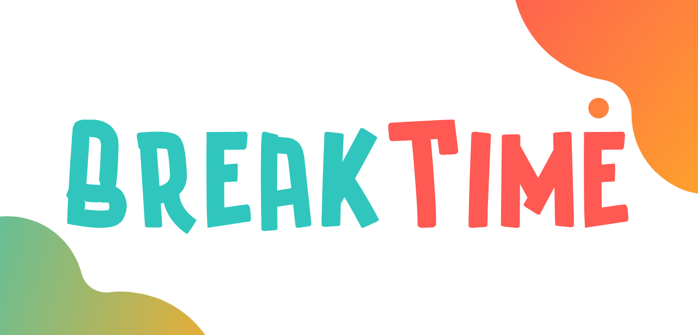
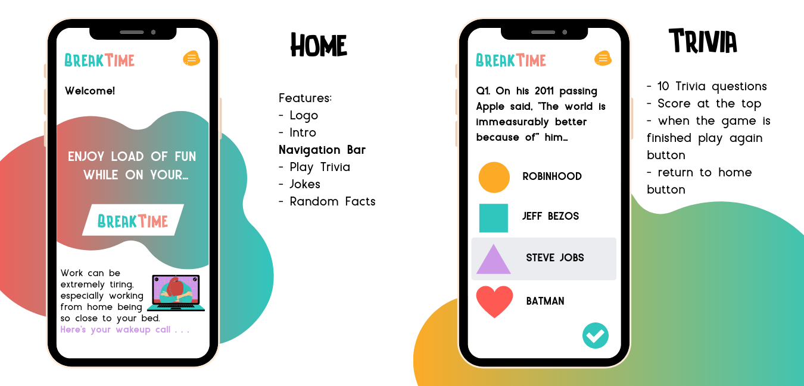
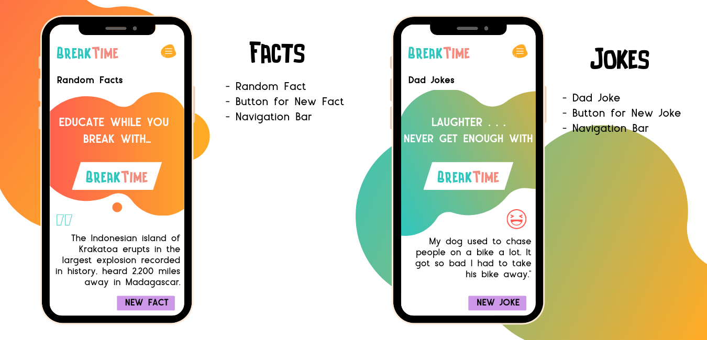
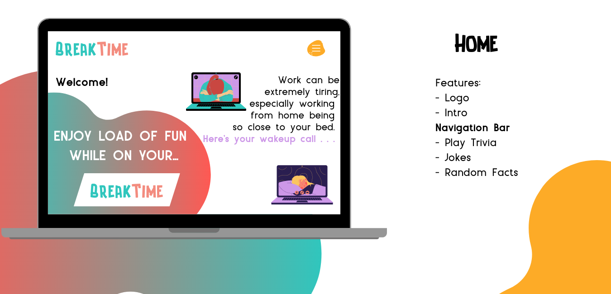
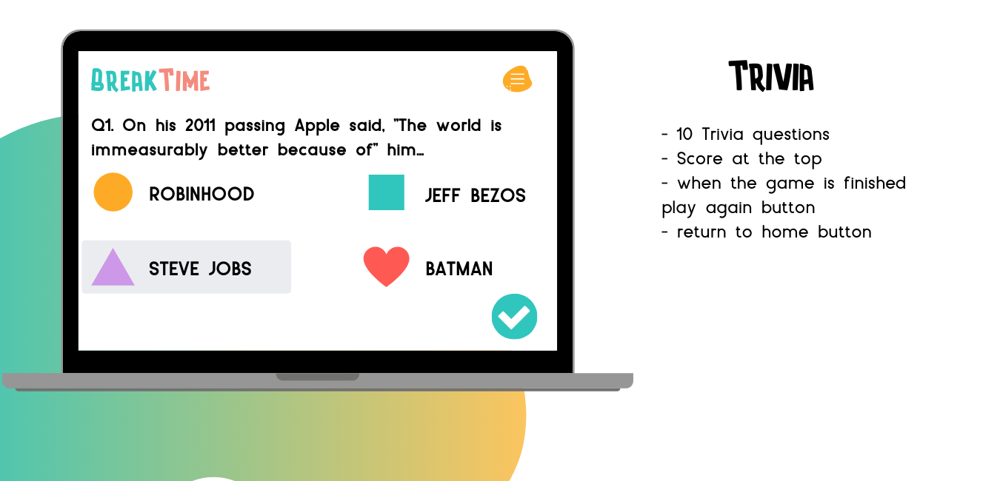
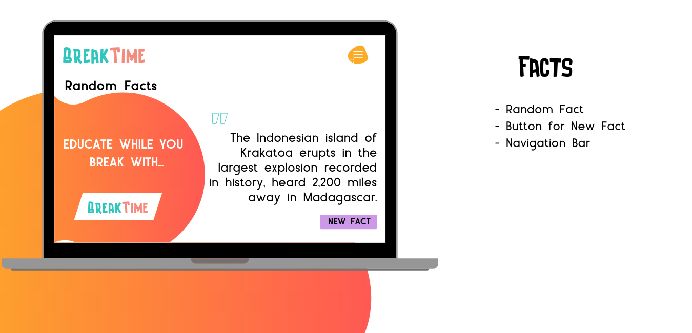
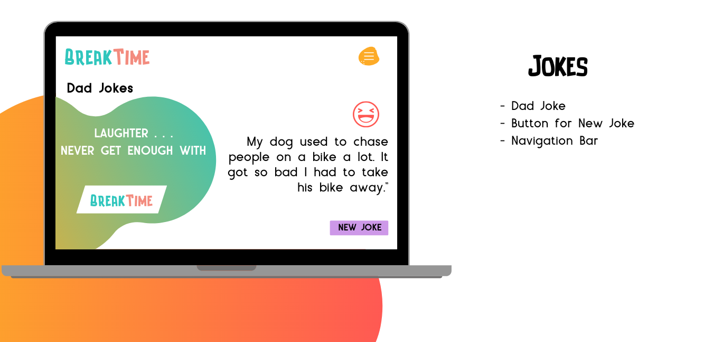
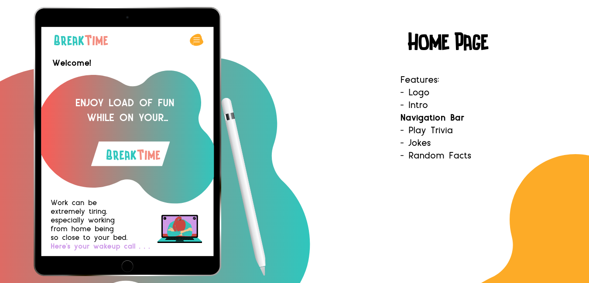
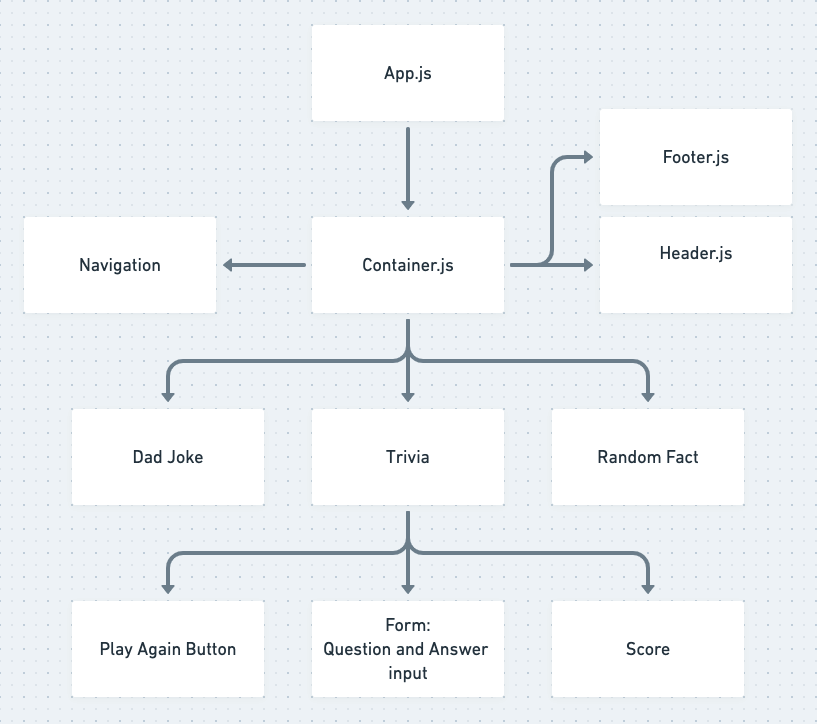

# BreakTime

Table of contents

- [Project Description](#project-description)
- [Wireframes](#wireframes)
- [Component Hierarchy](#component-hierarchy)
- [APIs Used](#apis-used)
- [MVP](#mvp)
- [Post-MVP](#post-mvp)

## Project Description

You are at work, and it's time for a break, what better to do than head over to BreakTime! BreakTime is a hub where people can hang out to relax and have fun. BreakTime offers services for users to play games such as trivia, get random jokes and random facts. For the Trivia game, BreakTime keeps the user's score to see how many points he/she gets per game.

## Wireframes

## Component Hierarchy

## APIs Used

- [Trivia](http://jservice.io/)
- [Jokes](https://icanhazdadjoke.com/api)
- [Random facts](https://fungenerators.com/api/facts/?ref=apilist.fun)

## MVP

Trivia Game

- Have a player start a game of ten questions
- Keep score of correct answers
- Reveal score when user finishes playing
- Add play again button

## Post-MVP

- Add Jokes section
- Add Random Facts section
- Add a backend to let players save their scores and have a score board
